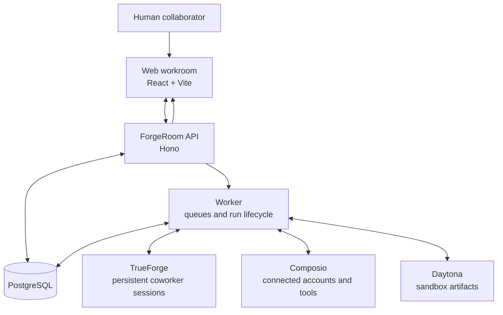
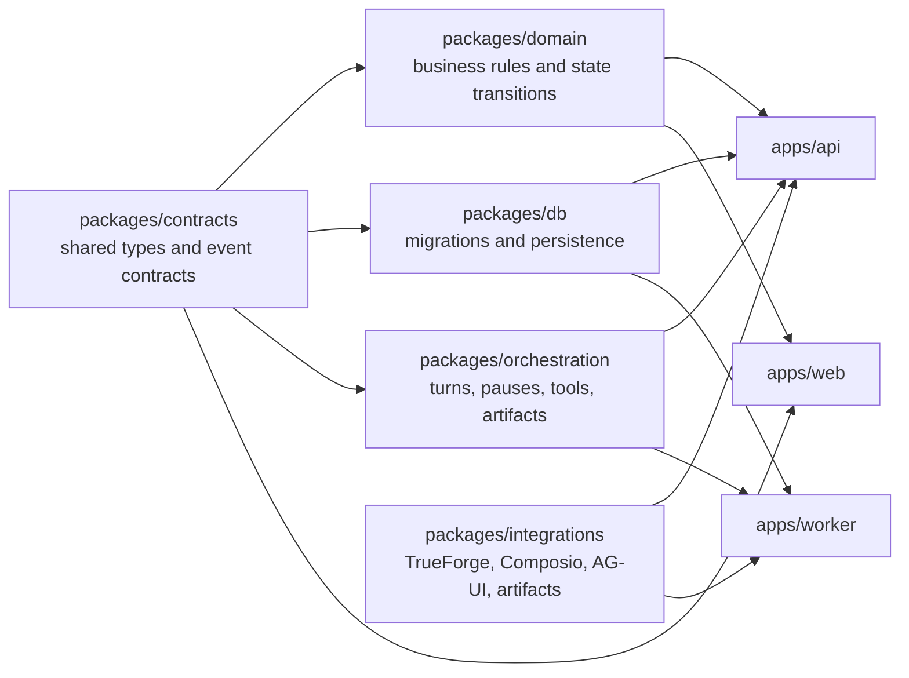

# ForgeRoom

**ForgeRoom is a shared workspace for people and persistent AI coworkers to do real work together—openly, visibly, and with human control at the moments that matter.**

[View the public repository](https://github.com/pramodthe/ForgeRoom) · [Read the product specs](./specs/README.md) · [Browse the commit history](https://github.com/pramodthe/ForgeRoom/commits/main)

## What ForgeRoom is

ForgeRoom is a collaborative workroom where a person works alongside persistent AI coworkers. Instead of treating AI work as a disposable chat response, it gives that work a shared place: a channel, task records, live status, controlled interactive results, artifacts, and an audit trail.

## The problem it solves

Most AI-agent workflows are hard to trust and hard to operate: work happens inside an opaque conversation or background process, tool permissions are broad, important actions can be difficult to inspect, and results disappear without durable context. Teams need AI coworkers that are useful without becoming unaccountable.

## How ForgeRoom solves it

ForgeRoom makes each stage of AI work visible and governed. A person assigns work in a shared channel, can watch persistent coworkers progress, receives structured results and artifacts, and must approve the exact external action before it can run. The resulting state is persisted so the work can be reviewed, replayed, and audited.

The product is designed around one trusted loop:

```text
request → governed coworker → visible work → reviewable result → exact approval → verified action
```

ForgeRoom is an active open-source project. Its core foundation is implemented, while the broader 0.1 showcase and release gates remain in progress. Later release goals are deliberately documented as roadmap work rather than represented as finished product.

## Key features in the current foundation

| Capability              | What it means in ForgeRoom                                                                                                                           |
| ----------------------- | ---------------------------------------------------------------------------------------------------------------------------------------------------- |
| Shared workrooms        | Authenticated workspace routes for channels, tasks, coworkers, skills, and connections.                                                              |
| Persistent AI coworkers | Coworkers run through separate TrueForge sessions instead of disappearing with a single browser interaction.                                         |
| Live, inspectable work  | Channel timelines can surface messages, run state, controlled UI, task records, and durable artifacts.                                               |
| Human approval boundary | Consequential actions pause for a trusted human to review the exact proposed effect; approval state is persisted and resumes through a guarded path. |
| Bounded integrations    | Connections and component tools are granted through explicit capabilities rather than ambient access.                                                |
| Durable foundation      | PostgreSQL migrations, shared contracts, a standalone worker, deterministic state handling, and automated tests support replayable work.             |

Provider-backed demonstrations require the appropriate local credentials and services. The health endpoint and most unit-level development work do not require those credentials.

## Architecture

### Platform overview



```text
React + Vite web app
        │
        ▼
Hono API ───── PostgreSQL
        │
        ├── TrueForge: persistent coworker runs
        ├── Composio: connected tools and accounts
        └── Daytona: sandbox-produced artifacts
        │
        ▼
Worker: queues, run lifecycle, approval resume, artifact publishing
```

### Governed work and approval flow

```mermaid
sequenceDiagram
  actor Human
  participant Web as Web workroom
  participant API as ForgeRoom API
  participant DB as PostgreSQL
  participant Worker as Worker
  participant Provider as Connected provider

  Human->>Web: Request work
  Web->>API: Create turn
  API->>DB: Persist run and queue state
  API->>Worker: Start queued work
  Worker->>Provider: Run permitted coworker/tool operation
  Provider-->>Worker: Events, result, or action proposal
  Worker->>DB: Persist replayable activity and state
  API-->>Web: Present live work, results, and artifacts

  alt Consequential action requires approval
    API->>DB: Persist encrypted pause and exact proposal
    API-->>Web: Show trusted approval card
    Human->>Web: Allow or deny
    Web->>API: Submit decision
    API->>DB: Record decision with compare-and-set guard
    API->>Worker: Resume only when allowed
    Worker->>Provider: Execute approved bounded action
    Provider-->>Worker: Verified result
    Worker->>DB: Store receipt and reconciled outcome
  else Action is denied
    API->>DB: Record denial; no provider mutation
  end
```

### Codebase layers



The repository is a TypeScript/pnpm workspace:

```text
apps/web                React + Vite workroom
apps/api                Hono HTTP API and integration boundary
apps/worker             Queue and run-lifecycle worker
packages/contracts      Shared domain and API contracts
packages/domain         Domain rules and transitions
packages/db             PostgreSQL schema, migrations, and persistence logic
packages/orchestration  Run, approval, and tool-execution orchestration
packages/integrations   TrueForge, Composio, AG-UI, artifacts, and UI MCP adapters
specs/                  Product contracts, acceptance criteria, decisions, and roadmap
infra/compose.yaml      Local PostgreSQL service
```

## Technology

- TypeScript, Node.js 22+, and pnpm workspaces
- React 19, Vite, TanStack Router, and TanStack Query
- Hono HTTP API and a standalone Node worker
- PostgreSQL with Drizzle ORM and versioned SQL migrations
- TrueForge for coworker execution, AG-UI for controlled interactive results
- Composio for connected tools and Daytona for sandbox artifacts
- Vitest, ESLint, Prettier, and TypeScript checks

## Run locally

### Prerequisites

- Node.js 22.12 or later
- [pnpm](https://pnpm.io/) 10.34.5
- Docker (recommended for local PostgreSQL)

### Setup

```bash
git clone https://github.com/pramodthe/ForgeRoom.git
cd ForgeRoom
pnpm install
cp .env.example .env
docker compose -f infra/compose.yaml up -d
pnpm --filter @forgeroom/db migrate
```

Start the API and web app in separate terminals:

```bash
pnpm dev
pnpm dev:web
```

The API listens on `http://localhost:3000` by default and the Vite development server reports its local URL when it starts.

For the full provider-backed workroom flow, configure the relevant values in `.env`:

- `DATABASE_URL` for PostgreSQL
- `OPENAI_API_KEY` and a local or hosted TrueForge instance for coworker runs
- `COMPOSIO_*` for connected-account tools
- `DAYTONA_API_KEY` for sandbox artifact generation

`.env.example` documents every variable. Never commit secrets; `.env` is ignored by Git.

### Run the worker separately

The API embeds the worker by default. To run it as its own process:

```bash
FORGEROOM_EMBED_WORKER=false pnpm dev
pnpm dev:worker
```

## Verify the project

```bash
pnpm preflight
pnpm lint
pnpm typecheck
pnpm test
pnpm build
```

`pnpm preflight` checks local dependency reachability and the checked-in P0 safety,
package, fixture, worker, component, coworker, Task, and skill invariants. It reports
each surface as `verified`, `reachable`, `configured`, or `blocked` and never prints
credential values. Local/static checks still run when provider credentials are absent;
provider-backed readiness remains blocked until those inputs are configured.

Use `pnpm preflight -- --json` for machine-readable output. Before a provider-backed
release rehearsal, use `pnpm preflight -- --require-providers`; a provider reported as
`configured` is ready for live testing, not proof that the live scenario passed.

To reset the optional local PostgreSQL database, remove its Docker volume and recreate it:

```bash
docker compose -f infra/compose.yaml down -v
docker compose -f infra/compose.yaml up -d
pnpm --filter @forgeroom/db migrate
```

## Trust and safety model

ForgeRoom treats external actions as a product boundary, not a prompt convention. The foundation includes:

- explicit workspace and session boundaries;
- scoped tool and component grants;
- persisted, encrypted pause/resume payloads for approval flows;
- exact trusted-human review before a consequential action resumes;
- task, artifact, and run state that can be replayed or audited; and
- provider credentials that stay server-side.

The full security and runtime contracts are public in the [foundation security specification](./specs/001-forgeroom-foundation/security.md) and [runtime specification](./specs/001-forgeroom-foundation/runtime.md).

## Project status and roadmap

ForgeRoom is in its 0.1 foundation and showcase phase. The focus is completing a demonstrable trusted-work loop: create coworkers, run concurrent work in a channel, present controlled results, pause for human approval, execute once, and retain the result.

The roadmap is intentionally ambitious but scoped by release:

- **0.1:** trusted workroom foundation and demo loop
- **0.2:** private alpha for small self-hosted teams
- **0.3:** scheduled workflows, triggers, and team collaboration
- **1.0:** production-grade open-source core

See the [release roadmap](./specs/002-forgeroom-platform/roadmap.md), [foundation status](./specs/001-forgeroom-foundation/STATUS.md), and [platform status](./specs/002-forgeroom-platform/STATUS.md) for the source of truth.

## Built in the open

This is a public repository with a real, inspectable development trail. Commits use task-oriented messages such as `feat(P0-315)` and `fix(P0-404)`, and meaningful behavior changes include tests alongside the affected packages. Judges and contributors can follow the project’s evolution through the [commit history](https://github.com/pramodthe/ForgeRoom/commits/main), [merged pull requests](https://github.com/pramodthe/ForgeRoom/pulls?q=is%3Apr+is%3Amerged), and traceable task records in [`specs/`](./specs/README.md).

Pull requests merge into `main` with a merge commit so the implementation and review history remain visible.

## Contributing

Start with the [specification workspace](./specs/README.md). It explains the product contracts, task states, acceptance criteria, and agent workflow. Choose a task that is marked ready, keep changes tied to the relevant requirement IDs, and run the verification commands above before opening a pull request.

## License

ForgeRoom is licensed under the [Apache License 2.0](./LICENSE). See
[NOTICE](./NOTICE) for attribution information and the
[production dependency review](./DEPENDENCY_LICENSES.md) for third-party license
evidence. The self-hosted core described in this repository does not require a
proprietary ForgeRoom control plane. An optional managed service may be offered
separately through stable public interfaces; that does not change the license or
capability contract of the self-hosted core. The full boundary is documented in the
[open-source product contract](./specs/002-forgeroom-platform/open-source.md).
