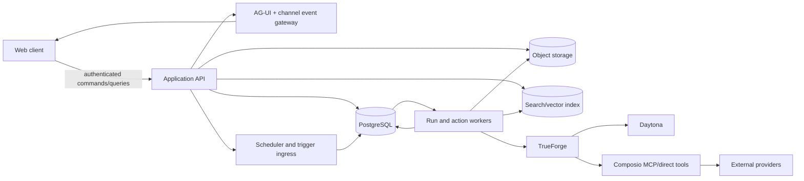

# Platform architecture

## Architectural shape

ForgeRoom is a modular application around a durable workspace database and event/outbox core. TrueForge is the execution plane, not the product database.



## Modules

| Module | Responsibility |
| --- | --- |
| Identity and workspace | Users, sessions, workspaces, memberships, roles, groups, invitations |
| Channels | Membership, messages, threads, recipients, pins, presence projection, sequence log |
| Coworkers | Profiles, natural-language drafts, versions, TrueForge manifests, grants, channel roster |
| Runtime | Run/RunStep/Turn queues, TrueForge sessions, AG-UI normalization, stop/resume, budgets |
| Capability compiler | Intersection of workspace policy, actor, coworker, channel, connection, tool, skill, record, knowledge, and workflow grants |
| Action gateway | Proposals, approvals, questions, idempotency, provider execution, reconciliation, audit |
| GenUI | Controlled component registry, data/action grants, UI instances, interaction commands, replay |
| Knowledge | File/URL/repository sources, byte storage, extraction, chunking, index, citations, deletion |
| Memory | Proposed/approved entries, scope, source, confidence, expiry, retrieval, revision, deletion |
| Skills | Drafts, packages, versions, tests, publication, attachment, import/export |
| Connections | OAuth/connect intents, safe account references, descriptor versions, policy packs, exact grants, health and revocation |
| Records | Schema registry, validated records, relations, views, history, provenance, agent tools |
| Workflows | Definitions, immutable versions, triggers, schedules, runs, steps, retries, handoffs |
| Notifications | In-app/email adapters, preferences, dedupe, escalation, approval inbox |
| Search and history | Authorized cross-domain projections, query/facets/snippets, canonical links, rebuild and Run lineage |
| Operations | Health, migrations, backups, quotas, usage, telemetry, incident/audit export |

## Authoritative writes

All product mutations follow:

```text
authenticate actor
→ resolve workspace/channel/resource scope
→ authorize against current policy and optimistic version
→ validate canonical command
→ commit entity change + audit row + outbox event atomically
→ deliver asynchronously with idempotent consumer
```

Workers may not mutate product state from raw model output. They submit typed commands through the same domain services used by humans.

## Runtime isolation

- A persistent coworker has one stable logical thread per channel and an independently rotatable TrueForge session generation.
- Temporary TrueForge subagents remain children of one coworker turn and inherit no extra product authority.
- Workspace, channel, workflow, and user context are compiled into bounded source-linked envelopes; raw full-history injection is forbidden.
- Any grant, skill, policy, model, account, or instruction change creates an immutable coworker/runtime revision and rotates affected sessions before new work.
- Interactive messages, scheduled workflows, and trigger runs enter the same queue and budget system.

## Data and consistency

- PostgreSQL is authoritative for metadata, state machines, authorization, sequence allocation, outbox, and audit.
- Object storage is authoritative for content-addressed file/artifact/render blobs; database rows bind expected hashes and retention.
- Search/vector indexes are derived, replaceable projections. A search hit never bypasses source authorization.
- Channel events use a monotonic sequence per channel. Every committed DomainEvent atomically allocates one unique monotonic workspace sequence and carries its aggregate revision; workspace order does not replace aggregate/channel semantics.
- Each retryable command has a workspace-scoped idempotency key. External writes additionally require provider-specific reconciliation policy.
- Background consumers use leases, bounded attempts, visibility timeouts, and dead-letter state; no infinite retry.

## Deployment modes

| Mode | Supported release | Shape |
| --- | --- | --- |
| Developer | 0.1 | One command, local web/API/worker, PostgreSQL/object-store dependencies, seeded non-production fixtures |
| Self-hosted single node | 0.2 | Container images, managed secrets, persistent volumes, migrations, backup/restore, TLS reverse-proxy contract |
| Self-hosted team/HA | 1.0 | Separate stateless API/workers/scheduler, external PostgreSQL/object storage, leader election, rolling migration policy |
| Hosted multi-tenant | 1.0 | Tenant-isolated shared control plane with per-workspace quotas, encryption context, audit, regional policy |

No deployment mode may default to a publicly reachable unauthenticated administrator. Development shortcuts must fail startup outside an explicit development environment.

## Extension boundaries

The supported extension types are:

- Git-backed skill packages.
- Connector and ToolPolicyDefinition packs.
- Controlled GenUI component packages.
- Record schema/view packages.
- Knowledge extractors.
- Trigger adapters and notification adapters.

Every package has a versioned manifest, declared permissions, compatibility range, migrations where relevant, integrity hash, publisher identity, test fixtures, and uninstall behavior. Server code, browser code, network access, tools, data reads, and actions are separate trust declarations. Unreviewed browser code is never mounted into the trusted host.

## Availability and recovery

- The outbox makes committed product state recoverable even when event delivery is interrupted.
- Active model turns may fail on process loss unless the pinned TrueForge contract proves resume; the application reports uncertain state and does not silently duplicate work.
- Scheduled trigger claims use database time, leader/lease coordination, unique occurrence keys, and misfire policy.
- Backups cover database plus referenced immutable blobs and encryption metadata. Restore verification checks hashes, indexes, memberships, pending approvals, workflow schedules, and audit continuity.
- Search indexes, notifications, and analytics rebuild from authoritative state/events.

## Architecture acceptance

- A self-host restore produces the same entity revisions, file hashes, pending approvals, next workflow occurrences, and audit chain.
- Revoking a member, connection, skill, knowledge source, or coworker grant stops new authority before the next run/interaction.
- A replayed event or command is either deduplicated or creates a new explicit revision; it never silently repeats an external mutation.
- A scheduled run and an interactive run proposing the same external write display and enforce equivalent policy.
